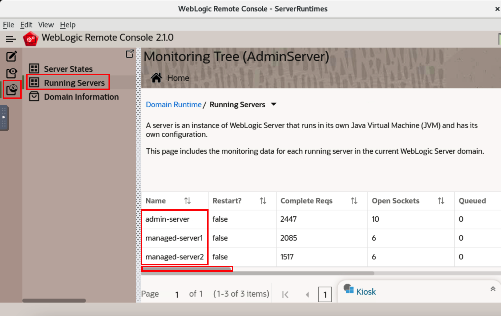

# Testing the Deployment of Application to the Oracle Container Engine for Kubernetes (OKE) on Oracle Cloud Infrastructure (OCI) 

## Introduction

### About Product/Technology

### Objectives

In this lab, you will:

* 

### Prerequisites

## Task 1: Access the Application through  the Browser

1. Copy the below URL and replace *XX.XX.XX.XX* with your public IP, which is populated in last lab. You can see the below output.
    

2. If you click on Refresh icon, You can see load balancing between two managed server pods.
    

## Task 2: Connection to Admin Server using WebLogic Remote Console

1. Go back to WebLogic Remote Console, Click on *Activities*, then select the *WebLogic Remote Console* Icon.
    

2. Select *Add Admin Server Connection Provider* and click *Choose*.
    

3. Enter the following data and click *OK*. 
    Connection Provider Name: Admin Server 
    Username: weblogic 
    Password: welcome1 
    URL:  `Copy_Public_IP_From_WKTUI` 
    

4. Click on *Configuration* icon, then Select *Services* -> *JDBC System Resources*. You can observe the same Datasouce, which we had seen in On-premise domain.
    

5. Click on *Monitoring* Icon as shown then select *Running Servers*. You can see we have *Admin Server* and 2 Managed Server pods are running. If you use *Scroll* Button in down side, you can see WebLogic Versin is *12.2.1.3.0*.
    
    

## Acknowledgements

* **Author** -  Ankit Pandey
* **Contributors** - Maciej Gruszka, Sid Joshi
* **Last Updated By/Date** - Kamryn Vinson, January 2022