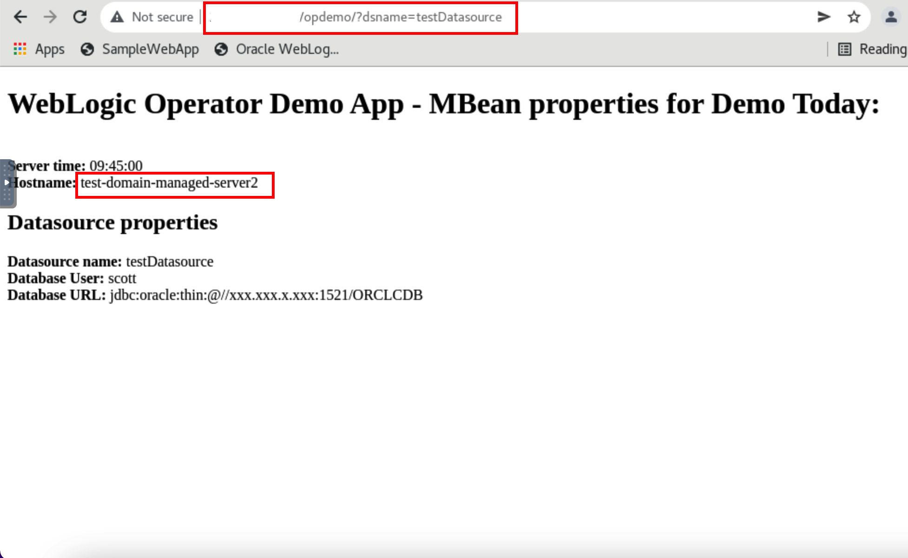
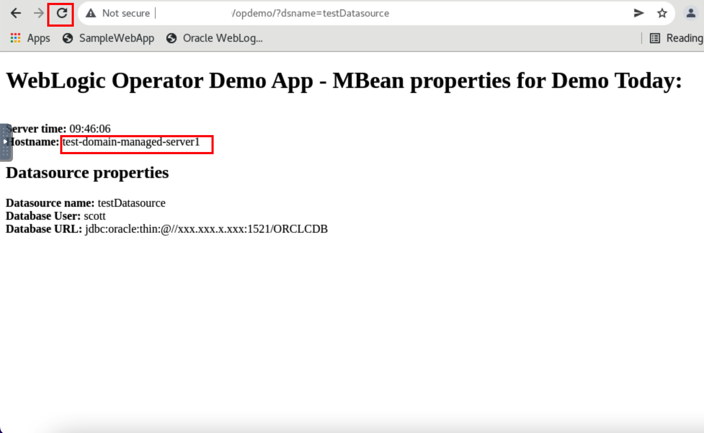
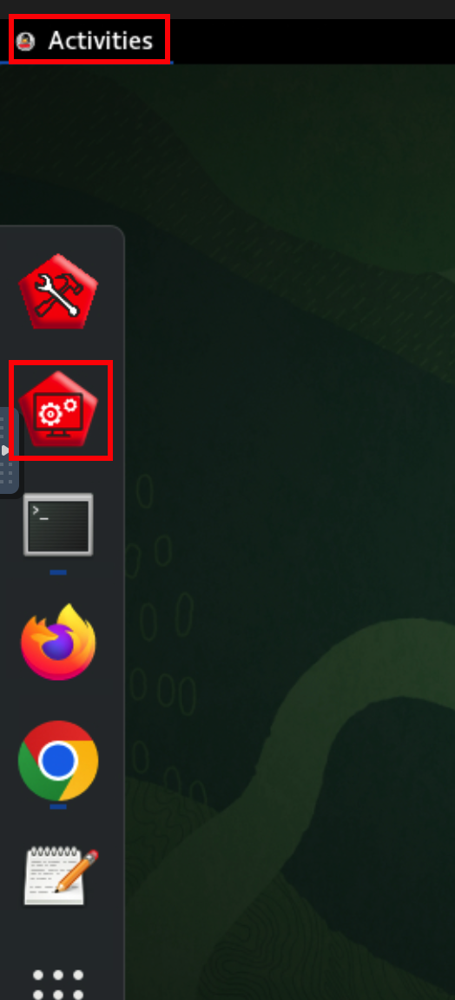
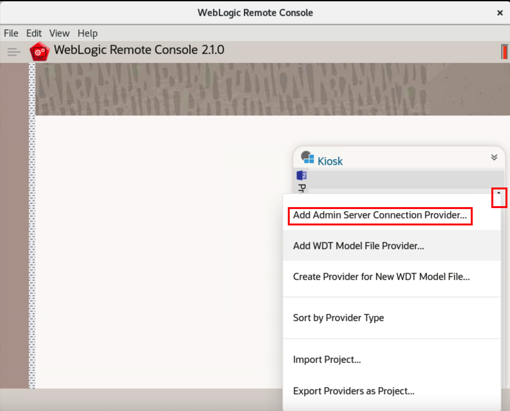
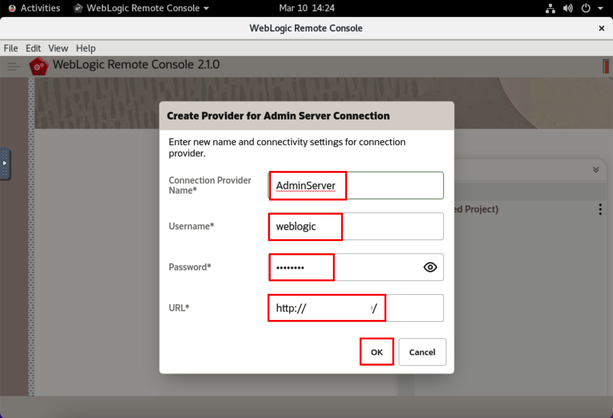
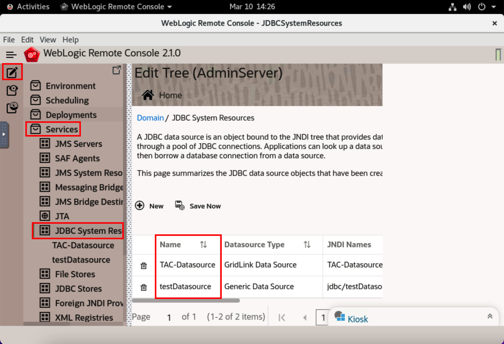
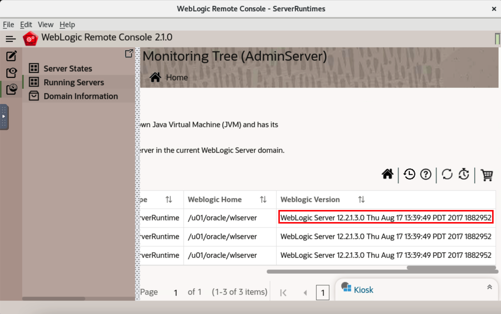

# Testing the Deployment of Application to the Oracle Container Engine for Kubernetes (OKE) on Oracle Cloud Infrastructure (OCI) 

## Introduction


### About Product/Technology


### Objectives

In this lab, you will:

* Access the Application through the Browser and verify the load balancing between two managed server pods.
* Connect to Admin Server using WebLogic Remote Console and explore the WewbLogic Domain and its resources.

### Prerequisites


## Task 1: Access the Application through the Browser

In this task, we access the *opdemo* application. We click on refresh icon to make multiple request to Application, to verify loadbalancing between two managed servers.

1. Copy the below URL and replace *XX.XX.XX.XX* with your IP, which is populated in last lab. You can see the below output.
    ```bash
    <copy>http://XX.XX.XX.XX/opdemo/?dsname=testDatasource</copy>
    ```
    


2. If you click on Refresh icon, You can see load balancing between two managed server pods.
    


## Task 2: Connection to Admin Server using WebLogic Remote Console

In this task, we explore the WebLogic Remote Console. We create connection to *Admin Server* in Remote Console and verify the resources in WebLogic Domain. This verifies the successful migration of an on-premise domain into the Oracle Kubernetes Cluster. 

1. Go back to WebLogic Remote Console, Click on *Activities*, then select the *WebLogic Remote Console* Icon.
    

2. Select *Add Admin Server Connection Provider* and click *Choose*.
    

3. Enter the following data and click *OK*.<br>
    Connection Provider Name: Admin<br> Server<br>
    Username: weblogic<br>
    Password: welcome1<br>
    URL:  `Copy_Public_IP_From_WKTUI`</br>
    

4. Click on *Edit Tree* icon, then Select *Services* -> *JDBC System Resources*. You can observe the same Datasouce, which we had seen in on-premise domain.
    

5. Click on *Monitoring Tree* Icon as shown then select *Running Servers*. You can see we have *Admin Server* and 2 Managed Server pods are running. If you use *Scroll* Button in down side, you can see WebLogic Versin is *12.2.1.3.0*.
    
    


## Acknowledgements

* **Author** -  Ankit Pandey
* **Contributors** - Maciej Gruszka, Sid Joshi
* **Last Updated By/Date** - Kamryn Vinson, January 2022