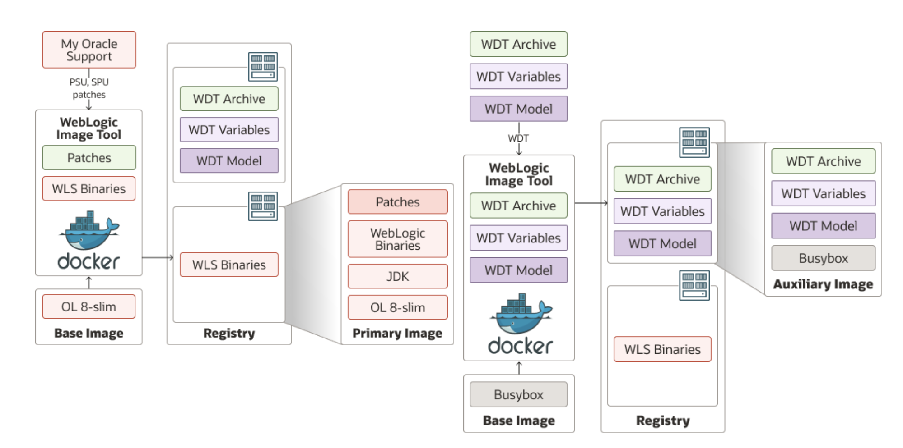
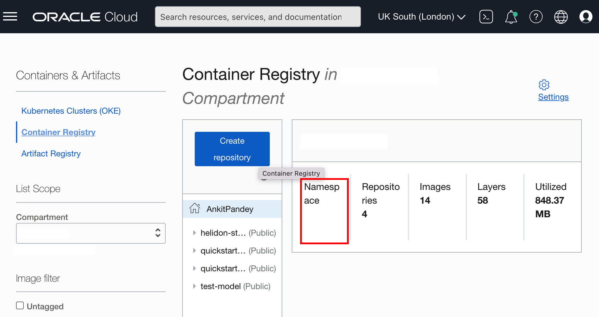
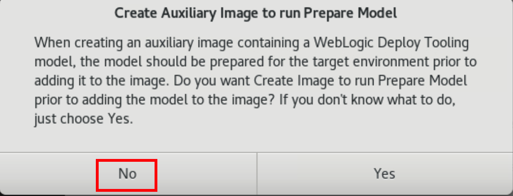

# Creation of Images for the Oracle Container Engine for Kubernetes (OKE) on Oracle Cloud Infrastructure (OCI)
## Introduction

In this Lab, We specify WebLogic server 12.2.1.3.0-ol8 image as Primary Image. Also, we create an auxiliary image, and push it to Oracle Container Image Registry repository using the generated authentication token. 

### Objectives

In this lab, you will:

* Enter WebLogic Server Image tag inside the Primary Image Tag in WebLogic Kubernetes Toolkit UI Application.
* Create an Auxiliary Image and push the image to Oracle Cloud Container Image Registry.

### Prerequisites

* You successfully created the repository in lab 1.
* You successfully generated the authentication token in lab 1.
* You successfully accepted the license agreement for WebLogic Server images in lab1. 
* You successfully created the virtual machine, which consist of all required softwares.
* You should have a text editor, where you can paste the commands and URLs and modify them, as per your environment. Then you can copy and paste the modified commands for running them in the terminal.


## Task 1: Enter details of Primary Container Image 


The *Image* section helps you build container images for deploying WebLogic-based applications in a Kubernetes environment using the [WebLogic Image Tool](https://oracle.github.io/weblogic-image-tool/).

**Primary Image** - The image containing the Oracle Fusion Middleware software. It is used as the basis of all containers that run WebLogic Servers for the domain.

In lab 1, we accepted the license agreement for WebLogic Server Images. In this task, we use WebLogic Server 12.2.1.3.0-ol8 image as Primary Image.

1. Click *Image*.We already pre-filled *Image Tag* with the below value. As you enter the *Image Tag*, It also populates the *Image Registry Address*.

    ```bash
    <copy>container-registry.oracle.com/middleware/weblogic:12.2.1.3-ol8</copy>
    ```
    
    > **For your Information Only:**<br>
    > The primary image is the one used for running the domain. One primary image can be reused for hundreds of domains. The primary image contains the OS, JDK, and FMW software installations.


## Task 2: Prepare Auxiliary Image and Push the Auxiliary Image to Oracle Container Image Registry 

**Auxiliary Image** - The image that supplies the WebLogic Deploy Tooling software and the model files. At runtime, the auxiliary image’s content is merged with the primary image’s content.
    

In this task, We are creating an Auxiliary image, which we will push to the Oracle Cloud Container Registry.

1. To create the Auxiliary Image Tag, we need the following information:

    * End point for the Region
    * Tenancy Namespace

    You can find out your *Region Name* in top right corner in the Oracle Cloud Console.
    

2. To find out the endpoint for your Region, select this URL [https://docs.oracle.com/en-us/iaas/Content/Registry/Concepts/registryprerequisites.htm#Availab](https://docs.oracle.com/en-us/iaas/Content/Registry/Concepts/registryprerequisites.htm#Availab). In my case, it is *UK South (London)* as the region name, thus its endpoint is *lhr.ocir.io*. Find out your endpoint for your own *Region Name* and save it in your text editor. We will also need it for lab 5.
    

3. In lab 1, you already noted the tenancy namespace in your text editor. If not, then for finding the Namespace of the tenancy, select the *Hamburger Menu* -> *Developer Services* -> *Container Registry*, as shown. Select your own compartment, you will find the Namespace as shown.
    

4. Now you have both the Tenancy Namespace and Endpoint for your region. Copy the following command and paste it in your text editor. Then replace the `END_POINT_OF_YOUR_REGION` with the endpoint of your region name, `NAMESPACE_OF_YOUR_TENANCY` with your tenancy's namespace. Click on *Auxiliary Image* tab as shown.
    

    ````bash
    <copy>END_POINT_OF_YOUR_REGION/NAMESPACE_OF_YOUR_TENANCY/test-model:v1</copy>
    ````

> For example, in my case Auxiliary Image tag is `lhr.ocir.io/tenancynamespace/test-model:v1`.

5. In the previous step, you also determined the tenancy namespace.
Enter the  Auxiliary Image Registry Push Username as follows: `NAMESPACE_OF_YOUR_TENANCY`/`YOUR_ORACLE_CLOUD_USERNAME`. <br>
* Replace `NAMESPACE_OF_YOUR_TENANCY` with your tenancy's namespace
* Replace `YOUR_ORACLE_CLOUD_USERNAME` with your Oracle Cloud Account user name and then copy the replaced username from your text editor and paste it in the *Auxiliary Image Registry Push Username*.
* For Password, copy and paste the Authentication Token from your text editor(or wherever you saved it) and paste it in the *Auxiliary Image Registry Push Username*.
    

6. Click *Create Auxiliary Image*.
    

7. As we already prepared the model in Lab 2, so click on *No*.
    

8. Select *Downloads* folder where we want to save *WebLogic Deployer* and click *Select* as shown.
    

9. Once Auxiliary images is successfully created, On *Create Auxiliary Image Complete* window, click *Ok*.
    
    > **For your Information Only:**<br>
    >  An auxiliary image is domain-specific. The auxiliary image contains the data that defines the domain.

10. Click *Push Auxiliary Image* to push the image in repository inside your Oracle Cloud Container Image Registry.
    
11. Once image is successfully pushed, On *Push Image Complete* window, click *Ok*. 
    


## Acknowledgements

* **Author** -  Ankit Pandey
* **Contributors** - Maciej Gruszka, Sid Joshi
* **Last Updated By/Date** - Kamryn Vinson, March 2022