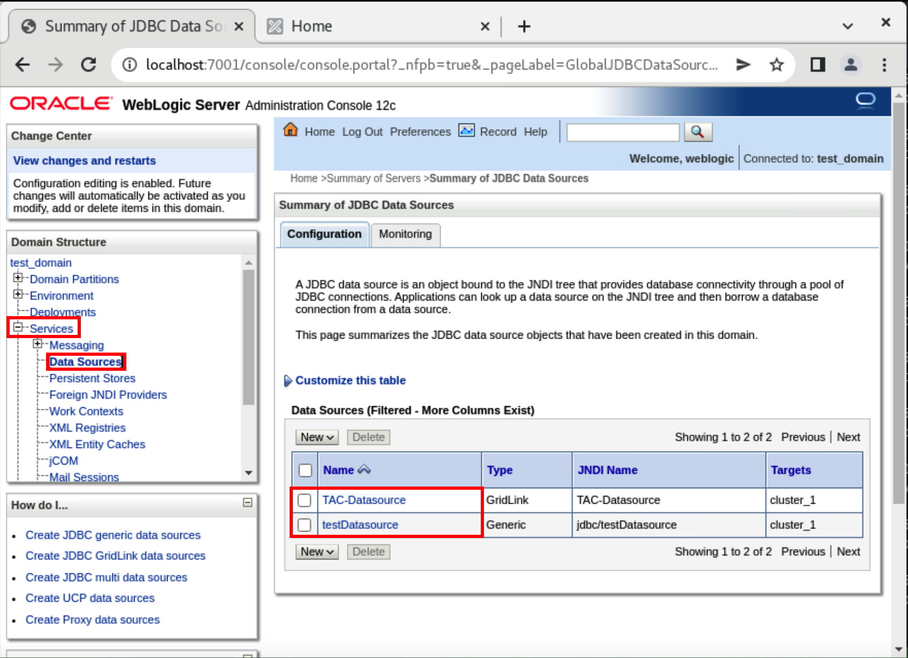
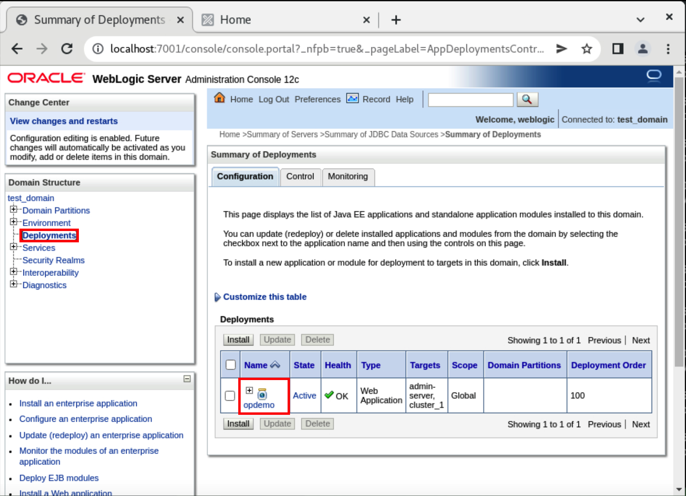
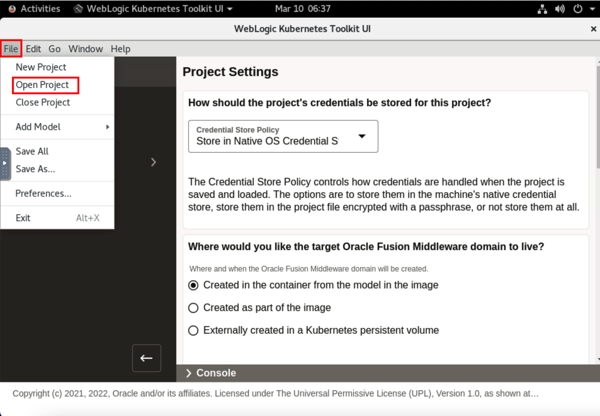
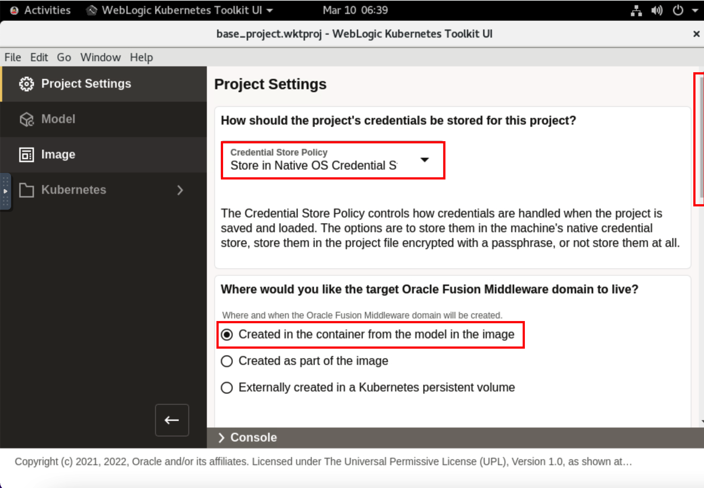
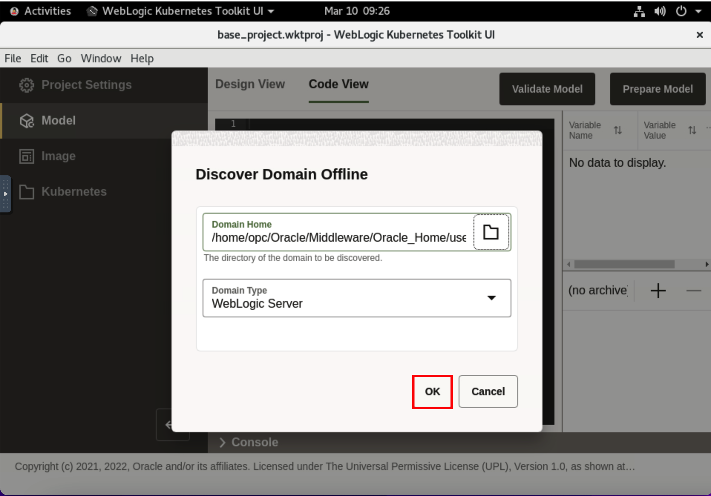

# Creation of Model for the Oracle Container Engine for Kubernetes (OKE) on Oracle Cloud Infrastructure (OCI)
## Introduction

In this lab, we explore the on-premise WebLogic domain. We navigate through the administration console to view the deployed application, datasources and servers in *test-domain*. we also open the pre-created *`base_project.wktproj`*, which already have pre-filled values for *Project Settings* section. Then we create the model file, by introspecting of an offline on-premise domain. At last, we validate the model and prepare the model to be deployed on Oracle Kubernetes Cluster (OKE).


### About WebLogic Kubernetes Toolkit UI Application

The WebLogic Kubernetes Toolkit (WKT) is a collection of open source tools that help you provision WebLogic-based applications to run in Linux containers on a Kubernetes cluster. WKT includes the following tools:<br>

* [WebLogic Deploy Tooling (WDT)](https://github.com/oracle/weblogic-deploy-tooling) - A set of single-purpose, lifecycle tools that operate off of a single metadata model representation of a WebLogic domain.
* [WebLogic Image Tool (WIT)](https://github.com/oracle/weblogic-image-tool) - A tool for creating Linux container images for running WebLogic domains.
* [WebLogic Kubernetes Operator (WKO)](https://github.com/oracle/weblogic-kubernetes-operator) - A Kubernetes operator that allows WebLogic domains to run natively in a Kubernetes cluster.

The WKT UI provides a graphical user interface that wraps the WKT tools, Docker, Helm, and the Kubernetes client (kubectl) and helps guide you through the process of creating and modifying a model of your WebLogic domain, creating a Linux container image to use to run the domain, and setting up and deploying the software and configuration necessary to deploy and access the domain in your Kubernetes cluster.

***WebLogic Kubernetes Toolkit Project Settings***

The first stop for every new project is Project Settings. 

**Choosing a Credential Storage Scheme**
    
The WKT UI application can securely store credentials for your project or not store them at all. The three choices are:<br>
* Use the Native OS Credential Store<br>
* Store Encrypted Credentials in the WKT Project File<br>
* Not Store Credentials<br>

If you choose Store in Native OS Credential Store, then you will be using the Windows Credential Manager, the macOS Keychain, or the Linux libsecret library’s credential store. These credential stores offer a well-known, secure mechanism for storing credentials that most users already understand. The only downside to this scheme is that the credentials are stored only on the local machine. Anyone trying to share their project with others users will have to have the other users re-enter the credentials so that they get saved to their local machine’s credential store.

We select this option for *Credential Store Policy* for our `base_project.wktproj`. 

For information about other two options, see the [Credential Storage Policy](https://oracle.github.io/weblogic-toolkit-ui/navigate/project-settings/#choosing-a-credential-storage-scheme).

**Choosing a Domain Location**

When getting started with a new WKT Project, one of the first things to consider is where you want the domain to reside. Domains can reside in a container, in an image, or in a persistent volume. Your choice will expose and hide different fields across most sections of the UI. 

In our *`base_project.wktproj`*, we are selecting *Created in the container from the model in the image*. The newest and most popular location for a domain is in the container. This is known as “Model in Image” but also referred to as a “From Model” in the underlying WKT tooling. In this case, the set of model-related files are added to the image. When the WebLogic Kubernetes Operator domain object is deployed, its inspector process runs and creates the WebLogic Server domain inside a running container on-the-fly. While this process adds a small amount of overhead at startup, it also makes it easier to maintain the image. For example, you can have a common WebLogic Server image that is updated periodically to pick up the latest Patch Set Updates (PSUs). Then, you use that image to add the most recent version of the WebLogic Deploy Tooling and your domain model files as a layer on top.

For information about other two options, see the [Target Oracle Fusion Middleware domain ](https://oracle.github.io/weblogic-toolkit-ui/navigate/project-settings/#choosing-a-domain-location).

**Choosing a Kubernetes Environment Target Type**

The target type tells the application what sort of Kubernetes environment that you plan to use. Currently, WebLogic Kubernetes Operator and Verrazzano are the only two choices. The application uses the target type to:<br>

* Tell WDT how to prepare the model for deployment.<br>
* Determine what sections and their associated actions within the application, to display.

For example, the Kubernetes pages are relevant to the WebLogic Kubernetes Operator target type, so those pages and their associated actions are hidden when the Verrazzano target type is selected; instead, the Verrazzano pages are displayed. Note that in the current release, Verrazzano support is limited to the Model and Image sections. 

In *`base_project.wktproj`*, we are selecting *WebLogic Kubernetes Operator* as `Kubernetes Environment Target Type`.

**Choosing the Java and Oracle Installation Directories**

The application uses these directories when invoking the WebLogic Deploy Tooling and WebLogic Image Tool; it does not use them for any other purpose. These are generally the top-level installation directories.

In *`base_project.wktproj`*, we are specifying  *`/usr/java/jdk1.8.0_321-amd64`* as `JAVA Installation Directory` and *`/home/opc/Oracle/Middleware/Oracle_Home`* as `Oracle Fusion Middleware Installation` directory.

**Choosing the Image Build Tool**

To build new images, inspect images, and interact with image repositories, the WKT UI application uses an image build tool, which defaults to docker. Your Virtual Machine already have docker installed in *`/usr/bin/docker`*. 

***Model***

The Model section helps you work with WebLogic Deploy Tooling models for a WebLogic domain. A WebLogic Deploy Tooling model for a domain can include the following file types:

* Model file - A declarative definition of the domain configuration.<br>
* Variable file - A property file that maps names to values. These names can be referenced from the model file to allow a model to be used across environments by applying the variable file for a particular environment to the model.<br>
* Archive file - A ZIP file containing application binaries and other files and directories needed to run the domain.<br>

For more information about WebLogic Deploy Tooling models, see [Metadata Model](https://oracle.github.io/weblogic-deploy-tooling/concepts/model/) and [Archive File](https://oracle.github.io/weblogic-deploy-tooling/concepts/archive/) in the WebLogic Deploy Tooling documentation.

For more information about Model section in WebLogic Kubernetes Toolkit UI, see [Model](https://oracle.github.io/weblogic-toolkit-ui/navigate/model/).

***Validate Model***

**Validate Model** invokes the WDT [Validate Model Tool](https://oracle.github.io/weblogic-deploy-tooling/userguide/tools/validate/), which validates that the model and its related artifacts are well-formed and provides help on the valid attributes and subfolders for a particular model location.

***Prepare Model***
**Prepare Model** invokes the WDT[Prepare Model Tool](https://oracle.github.io/weblogic-deploy-tooling/userguide/tools/prepare/) to modify the model to work in a Kubernetes cluster with WebLogic Kubernetes Operator or Verrazzano installed. It is also possible to run Prepare Model during the Create Image action, though typically it is best to run Prepare Model explicitly, prior to moving to the Image section.

Prepare Model does the following:

* Removes model sections and fields that are not compatible with the target environment.
* Replaces endpoint values with model tokens that reference variables.
* Replaces credential values with model tokens that reference either a field in a Kubernetes secret or a variable.
* Provides default values for fields displayed in the application’s variable, variable overrides, and secret editors.
* Extracts topology information to the application that it uses to generate the resource file used to deploy the domain.

### Objectives

In this lab, you will:

* Explore the on-premise WebLogic domain *test-domain* and view its deployed application, servers and datasources.
* Open the base WKT project, which contains some pre-filled values.
* Introspection of an offline on-premise domain using WebLogic Kubernetes Toolkit UI Application.
* Validate and prepare model to be deployed on Oracle Kubernetes Cluster (OKE). 

### Prerequisites

To run Lab 2, you must have:
* Successfully created the Virtual machine using the custome image. As this virtual machine contains all the required software like JDK, Oracle WebLogic Server, Helm, Kubectl and Docker.


## Task 1: Start the Admin Server and verify the resources in existing on-premise domain

This Virtual Machine, contains WebLogic Domain *test-domain* with WebLogic Server version *12.2.1.3.0*. This *test-domain* have one application *opdemo* deployed, two datasources and one dynamic cluster. 

In this Task, we start the Admin Server in this *test-domain*, and navigate through the resources using WebLogic Administration console.

1. On left side, click *Arrow Icon* -> *Setting Icon* and then select *Remote Resizing* as shown below.
    
 > Again click on *Arrow Icon* to hide the *Settings* option. 

2. To open the terminal, click *Activities* -> *Terminal icon*.
    
 
3. To start the Admin Server in *test-domain*, copy the following commands and paste it in terminal.
    ````bash
    <copy>cd ~/Oracle/Middleware/Oracle_Home/user_projects/domains/test_domain/bin/
    ./startWebLogic.sh</copy>
    ````
    > This *~/Oracle/Middleware/Oracle_Home/user_projects/domains/test_domain/* is your domain home directory. For copy and paste between the host machine and remote desktop, Use the Clipboard. For example, if you want copy from the host machine and want to paste it inside the remote desktop, you need to first paste in the clipboard first, then you can paste it in remote desktop.

    
    

4. To open Chrome Browser, click *Activities* -> *Chrome Icon*.
    

5. During the whole workshop, whenever you see this window, enter *welcome1* as password and click *Unlock*.   
    

6. Click bookmark for *Oracle WebLogic Server Administrative Console*.
    
    
7. Enter *weblogic/Welcome1%* as `Username/Password`, then click *Login*. You can see, we have WebLogic Server version *12.2.1.3.0*.   
    

8. To view available servers, expand *Environment* and click *Servers*. You can see, we have one dynamic clusters with 5 managed servers. 
    

9. To view the datasources, expand *Services* and click *Data Sources*.
    

10. To view the deployed application, click *Deployment*. You can see, we have *opdemo* as deployed application.
    

11. To shutdown the Admin Server, go back to terminal. Click *Activities* and select the *Terminal* window.
    

12. Press *`Ctrl + C`* to shutdown the Admin Server.
    


## Task 2: Opening the base WKT UI Project

This Virtual Machine have *WebLogic Server*, *docker*, *helm*, *kubectl*, *JDK* installed. So we created a WKT Project *`base_project.wktproj`* for you, which already specified the installation directory for these softwares. You don't need to fill those values. 

In this task, we open a pre created  *`base_project.wktproj`* project. We see the different settings in *Project Settings* section.

1. Click *Activities* and then select the icon for *WebLogic Kubernetes Toolkit UI*.
    

2. To open *base_project.wktproj* project, click *File* -> *Open Project*. 
    

3. Click *Downloads* in left side, then choose *base_project.wktproj* and click *Open Project*.
    
    > As *Credential Story Policy*, we select **Store in Native OS Credentials Store**. It means the credentials (like for WebLogic Server and datasources) are only stored on the local machine.<br>
    > For *Where would you like the target Oracle Fusion Middleware domain to live?*, we select **Created in the container from the model in the image**. In this case, the set of model-related files are added to the image. So when the WebLogic Kubernetes Operator domain object is deployed, its inspector process runs and creates the WebLogic Server domain inside a running container on-the-fly.

    
    > As *Kubernetes Environment Target Type*, we select **WebLogic Kubernetes Operator**. This means, you want this domain to be deployed in Kubernetes managed by the WebLogic Kubernetes Operator. This settings also determine what sections and their associated actions within the application, to display.<br>
    > we also specify the location for *JAVA HOME* and *ORACLE_HOME*. WebLogic Kubernetes Toolkit UI uses this directory when invoking the WebLogic Deployer Tooling and WebLogic Image Tool. <br>
    > To build new images, inspect images and interact with image repositories, the WKT UI application uses an image build tool, which defaults to docker.

    
    


## Task 3: Introspection of an Offline on-premise domain 

In this task, we will use *File* -> *Add Model* menu to create a model of an existing *test-domain* using the `WebLogic Deploy Tooling's` [Discover Domain Tool](https://oracle.github.io/weblogic-deploy-tooling/userguide/tools/discover/). This *Model* section allows you to introspect a domain configuration.

For more information on *Model* section, see the *Introduction* section of this lab.

1. In WebLogic Kubernetes Toolkit UI, Click *Model*.
    

2. Click *File* -> *Add Model* -> *Discover Model(offline)*.
    

3. Click Open folder *icon* to open the *Domain Home*.
    

4. In the Home folder, navigate to *`/home/opc/Oracle/Middleware/Oracle_Home/user_projects/domains/`* directory and select *test-domain* folder then  click *Select*. Click *OK*.
    
    
    > If you look the console, you will see that this invokes WebLogic Deployer Tool to introspect the domain configuration in offline mode. 

5. You can see the window as shown below, at the end, you will have model ready for you.
    
    > The result of this WDT introspection are model(a metadata representation of your domain configuration), placeholder, where you can specify the values (like password for datasource) and application in the application archive.

## Task 4: Validate and Prepare Model to be deployed on Kubernetes Cluster

In this task, we validate the model and prepare the model to be deployed on Oracle Kubernetes Cluster (OKE). you can see more details about *Validate Model* and *Prepare Model* in the *Introduction* section of this lab.

1. To Validate the model, click *Validate Model*.
    

2. Once model validation is successful and you see notification for the same, then click *Ok*.
    

3. To prepare the model, to be deployed on Kubernetes cluster, click *Prepare Model*
    

4. Once model is successfully prepared, click *Ok*.
    


## Acknowledgements

* **Author** -  Ankit Pandey
* **Contributors** - Maciej Gruszka, Sid Joshi
* **Last Updated By/Date** - Kamryn Vinson, March 2022