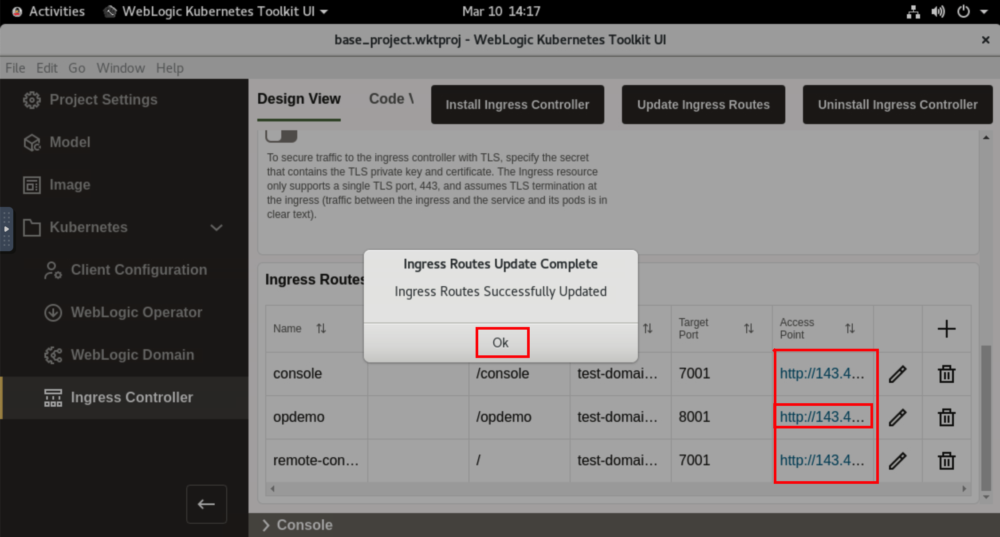

# Deployment of Ingress Controller to the Oracle Container Engine for Kubernetes (OKE) on Oracle Cloud Infrastructure (OCI) From WebLogic Kubernetes Toolkit UI

## Introduction

### About Product/Technology

### Objectives

In this lab, you will:

* 

### Prerequisites

## Task Installtion of Ingress Controller to the Oracle Container Engine for Kubernetes (OKE) on Oracle Cloud In

1. Click *Ingress Controller*. You can see some pre-filled values, let it remain the same and click *Install Ingress Controller*.
    

2. Once you see *Ingress Controller Installation Complete*, click *Ok*.
    

## Task 2: Update the Ingress Routes to Access the Application and Admin Console

1. Scroll down and click on *+* icone to add the *Ingress Route Configuration*. 
    

2. Click on Edit icon as shown to modify the values.
    

3. Enter the following details and click on *OK*.
        Name: console 
        Path Expression: /console
        Target Service Namespace: test-domain-ns
        Target Service: test-domain-admin-server
        Target Port: 7001

    

4. In the similar way, add the following *opdemo* Ingress Routes as well:
        Name: opdemo
        Path Expression: /opdemo
        Target Service Namespace:
        Target Service:    
        Target Port:
    

5. In the similar way, add the following *opdemo* Ingress Routes as well:
        Name: remote-console
        Path Expression: / 
        Target Service Namespace: test-domain-ns
        Target Service: test-domain-admin-server
        Target Port: 7001
        

6. To update the Inress Routes, click *Update Ingress Routes*.
    

7. Once you see *Ingress Routes Update Complete* window, Click *Ok*.
    

## Acknowledgements

* **Author** -  Ankit Pandey
* **Contributors** - Maciej Gruszka, Sid Joshi
* **Last Updated By/Date** - Kamryn Vinson, January 2022