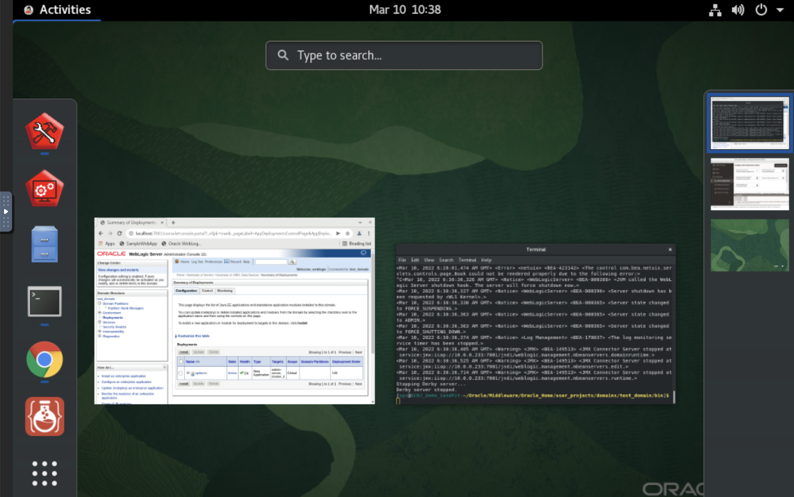
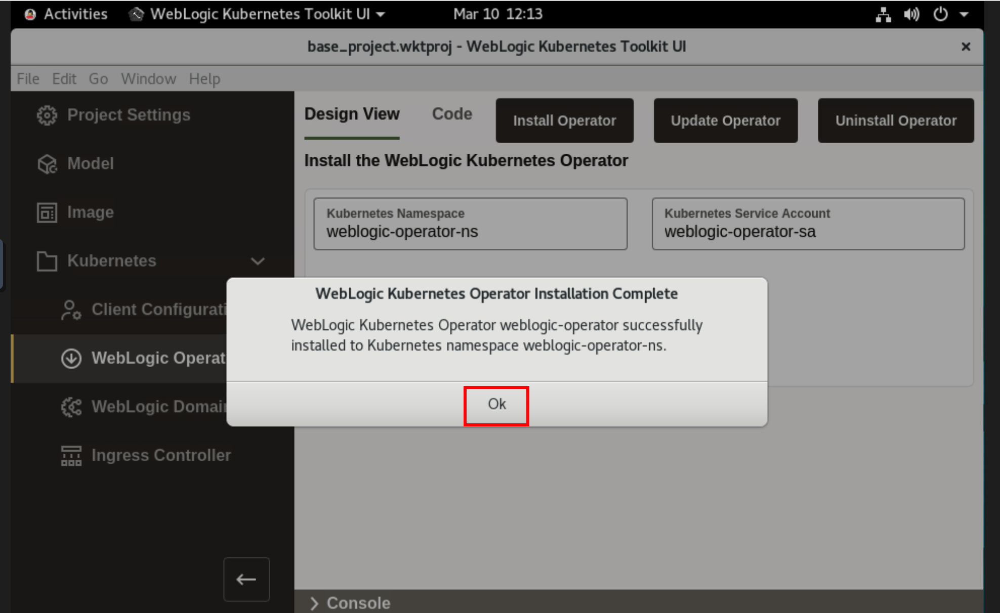

# Deployment of WebLogic Kubernetes Operator to the Oracle Container Engine for Kubernetes (OKE) on Oracle Cloud Infrastructure (OCI) From WebLogic Kubernetes Toolkit UI

## Introduction

### About Product/Technology

### Objectives

In this lab, you will:

* 

### Prerequisites

## Task 1: Configure kubectl (Kubernetes Cluster CLI) to connect to Oracle Container Engine for Kubernetes (OKE) on Oracle Cloud Infrastructure (OCI)

1. In the Console, select the *Hamburger Menu* -> *Developer Services* -> *Kubernetes Clusters (OKE)* as shown.
    

2. Click *Access Cluster*. 
    

3. Select *Local Access* and then click on *Copy* as shown.
    

4. Go back to terminal, Click on *Activities* and select the *Terminal*.
    

5. Paste the copied command in the terminal. For *Do you want to create a new config file?*, Type *y* then press *Enter*. For *Do you want to create your config file by logging in through a browser?*, Type *y* then press *Enter*.
    

6. In Chrome Browser, Click *Accept all*.
    

7. Enter your tenancy name and click *Continue*.
    

8. Enter your Cloud account Username and Password and then click *Sign In*.
    
    > You will see *Authorization Completed* as shown.
    

9. In *Enter a passphrase for your private key*, leave it empty and press *Enter*.
    

10. Use the upper arrow key to run the *oce ce ...* command again and re-run it multiple time, until you see the *New config written to the Kubeconfig file /home/opc/.kube/config*.
    

## Task 2: Verify Connectivity of WebLogic Kubernetes Toolkit UI to Oracle Container Engine for Kubernetes (OKE) on Oracle Cloud Infrastructure (OCI)

1. Go back to WebLogic Kubernetes Tool Kit UI, Click *Activities* and select the WebLogic Kubernetes Tool Kit UI window. Click *Client Configuration* under Kubernetes.
    

2. Click *Verify Connectivity*.
    

3. Once you see *Verify Kubernetes Client Connectivity Success* window, Click *Ok*.
    

## Task 3: Install the WebLogic Kubernetes Operator

1. Click *WebLogic Operator*. You  see some pre-filled values. lets it remain the same and click *Install Operator*.
     
    
    > Theory
    
    > Theory
    
    > Theory
    

2. Once you see *WebLogic Kubernetes Operator Installation Complete*, Click *Ok*.
    

## Acknowledgements

* **Author** -  Ankit Pandey
* **Contributors** - Maciej Gruszka, Sid Joshi
* **Last Updated By/Date** - Kamryn Vinson, January 2022