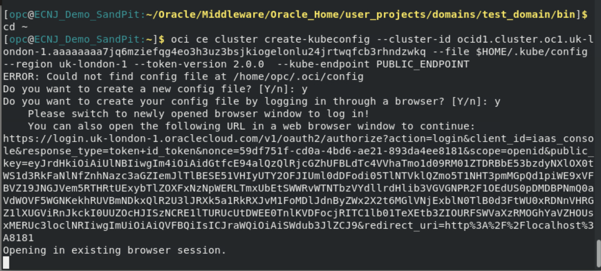
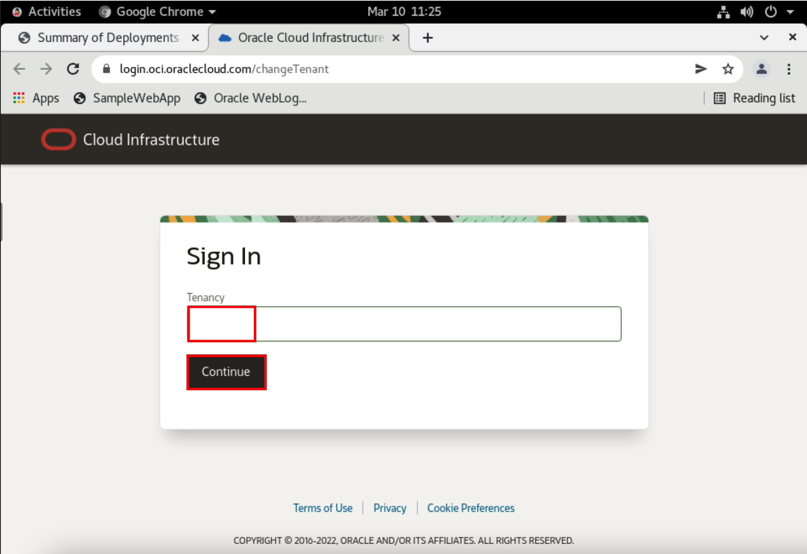
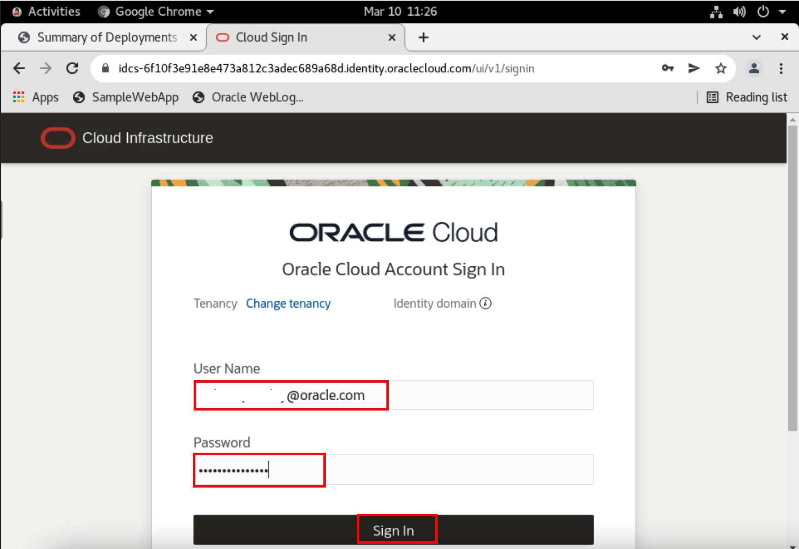
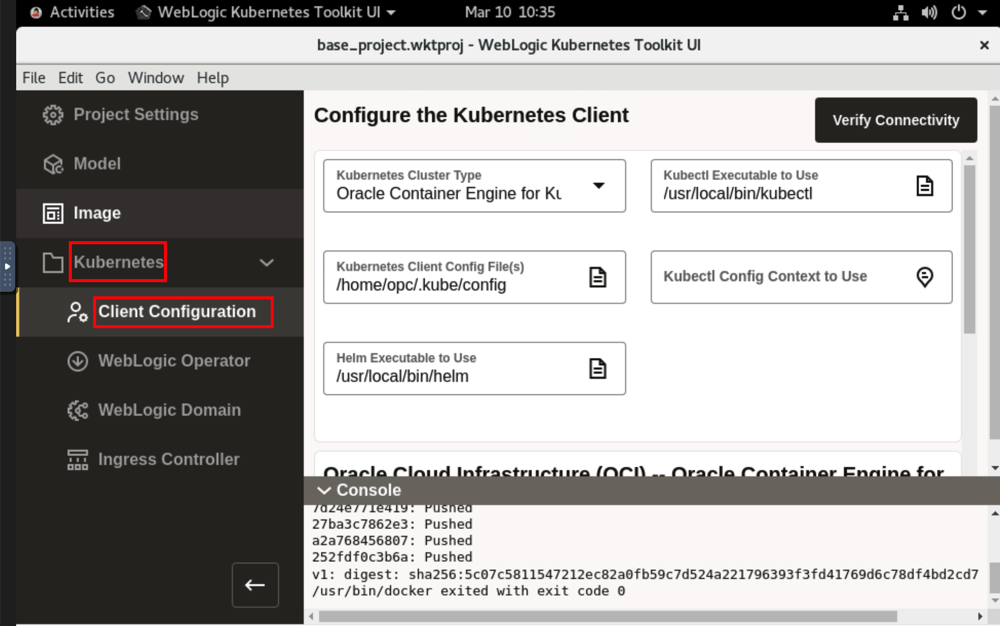
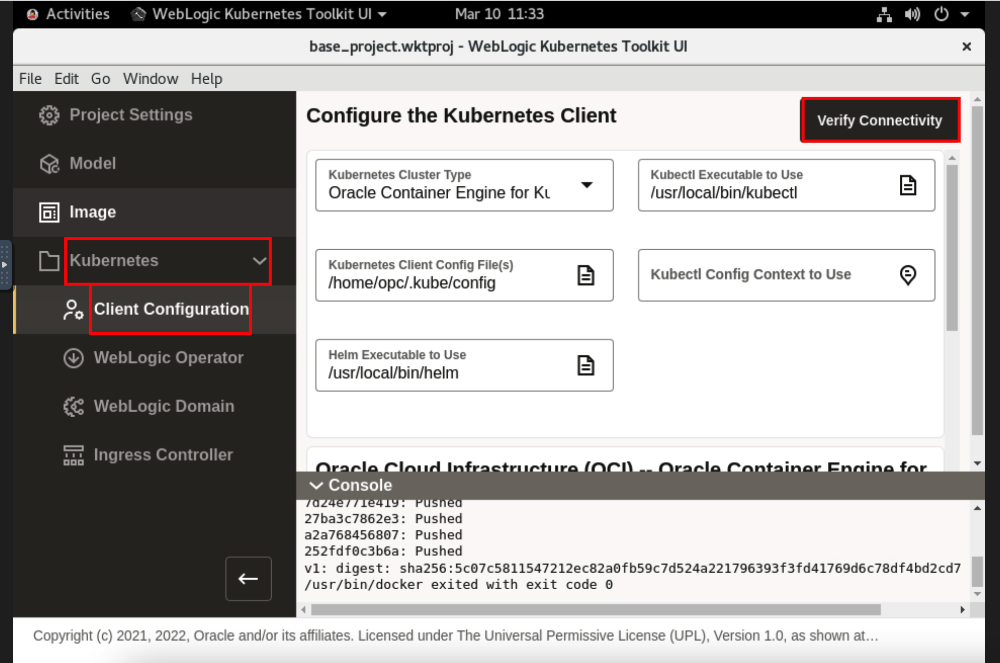
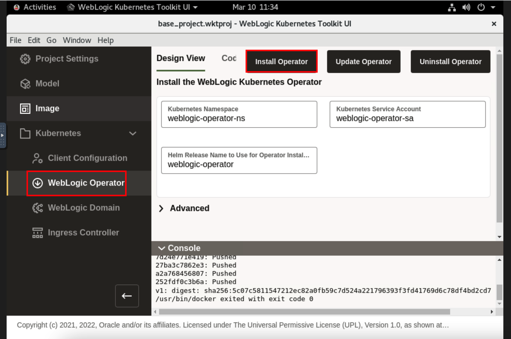
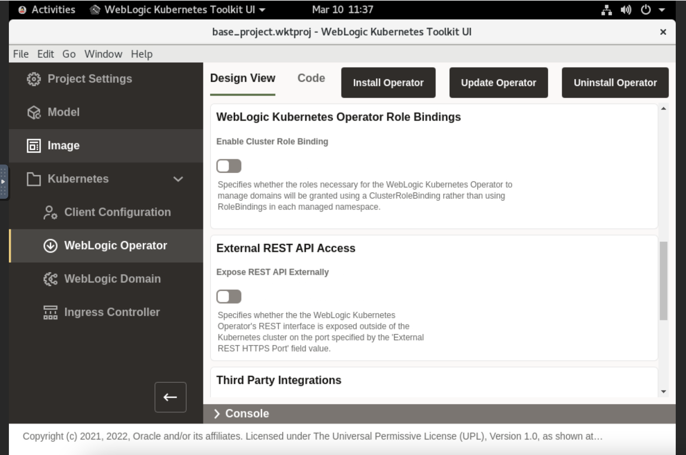
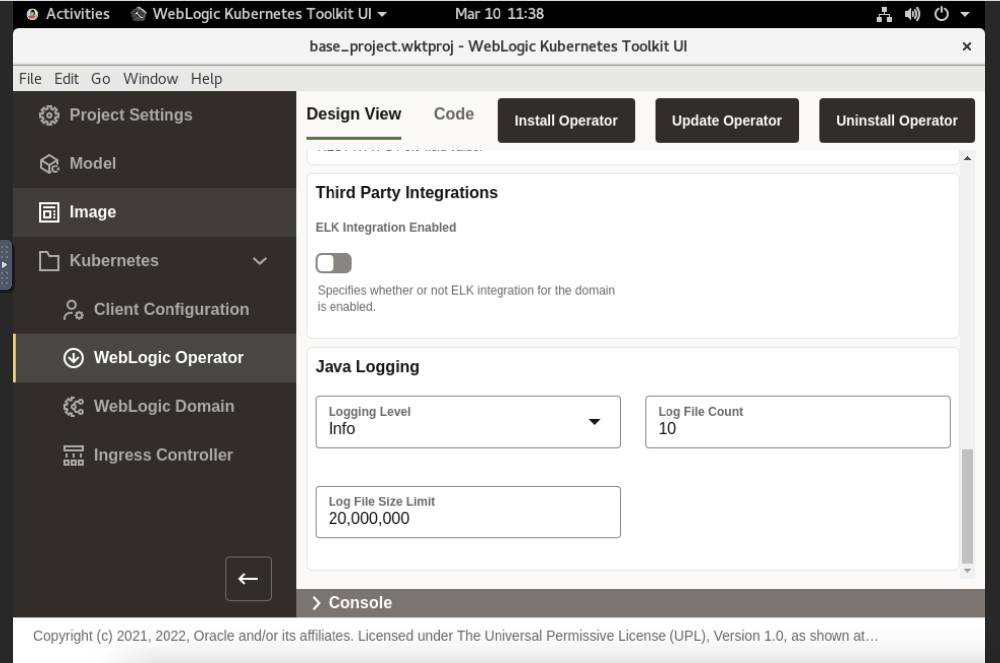

# Deployment of WebLogic Kubernetes Operator to the Oracle Container Engine for Kubernetes (OKE) on Oracle Cloud Infrastructure (OCI) From WebLogic Kubernetes Toolkit UI

## Introduction

### About Product/Technology

### Objectives

In this lab, you will:

* Configure kubectl (Kubernetes Cluster CLI) to connect to Oracle Container Engine for Kubernetes (OKE) on Oracle Cloud Infrastructure (OCI).
* Verify Connectivity of WebLogic Kubernetes Toolkit UI to Oracle Container Engine for Kubernetes (OKE) on Oracle Cloud Infrastructure (OCI).
* Install the WebLogic Kubernetes Operator to Oracle Container Engine for Kubernetes (OKE) on Oracle Cloud Infrastructure (OCI). 

### Prerequisites

## Task 1: Configure kubectl (Kubernetes Cluster CLI) to connect to Oracle Container Engine for Kubernetes (OKE) on Oracle Cloud Infrastructure (OCI)

In this Task, we creats the configuration file *.oci/config* and *.kube/config* in */home/opc* directory. This configuration file allow us to access Oracle Kubernetes Cluster (OKE) from this virtual machine.

For more information on Client Configuration, see [Client Configuration](https://oracle.github.io/weblogic-toolkit-ui/navigate/kubernetes/k8s-client-config/).

1. In the Console, select the *Hamburger Menu* -> *Developer Services* -> *Kubernetes Clusters (OKE)* as shown.
    

2. Click *Access Cluster*. 
    

3. Select *Local Access* and then click on *Copy* as shown.
    

4. Go back to terminal, Click on *Activities* and select the *Terminal*.
    

5. Paste the copied command in the terminal. For *Do you want to create a new config file?*, Type *y* then press *Enter*. For *Do you want to create your config file by logging in through a browser?*, Type *y* then press *Enter*.
    

6. In Chrome Browser, Click *Accept all*.
    

7. Enter your tenancy name and click *Continue*.
    

8. Enter your Cloud account Username and Password and then click *Sign In*.
    
    > You will see *Authorization Completed* as shown.
    

9. In *Enter a passphrase for your private key*, leave it empty and press *Enter*.
    

10. Use the upper arrow key to run the *oce ce ...* command again and re-run it multiple time, until you see the *New config written to the Kubeconfig file /home/opc/.kube/config*.
    

## Task 2: Verify Connectivity of WebLogic Kubernetes Toolkit UI to Oracle Container Engine for Kubernetes (OKE) on Oracle Cloud Infrastructure (OCI)

In this task, we verify the connectivity to *Oracle Kubernetes Cluster(OKE)* from the `WebLogic Kubernetes Toolkit UI` application.

1. Go back to WebLogic Kubernetes Tool Kit UI, Click *Activities* and select the WebLogic Kubernetes Tool Kit UI window. Click *Client Configuration* under Kubernetes.
    
    

2. Click *Verify Connectivity*.
    

3. Once you see *Verify Kubernetes Client Connectivity Success* window, Click *Ok*.
    

## Task 3: Install the WebLogic Kubernetes Operator to Oracle Container Engine for Kubernetes (OKE) on Oracle Cloud Infrastructure (OCI)

***WebLogic Kubernetes Operator***

This section provides support for installing the WebLogic Kubernetes Operator (the “operator”) in the target Kubernetes cluster. 

1. Click *WebLogic Operator*. You  see some pre-filled values. lets it remain the same and click *Install Operator*.

    **Kubernetes Namespace** - The Kubernetes namespace to which to install the operator. 
    **Kubernetes Service Account** - The Kubernetes service account for the operator to use when making Kubernetes API requests. 
    **Helm Release Name to Use for Operator Installation** - The Helm release name to use to identify this installation. 

     
    
    
    

 > For more information on *WebLogic Kubernetes Operator Image*, *Kubernetes Namespace Selection Strategy*, *WebLogic Kubernetes Role Bindings*, *External REST API Access*, *Third Party Integrations* and *Java Logging*, see the [WebLogic Kubernetes Operator](https://oracle.github.io/weblogic-toolkit-ui/navigate/kubernetes/k8s-wko/) documentation.

2. Once you see *WebLogic Kubernetes Operator Installation Complete*, Click *Ok*.
    

## Acknowledgements

* **Author** -  Ankit Pandey
* **Contributors** - Maciej Gruszka, Sid Joshi
* **Last Updated By/Date** - Kamryn Vinson, March 2022