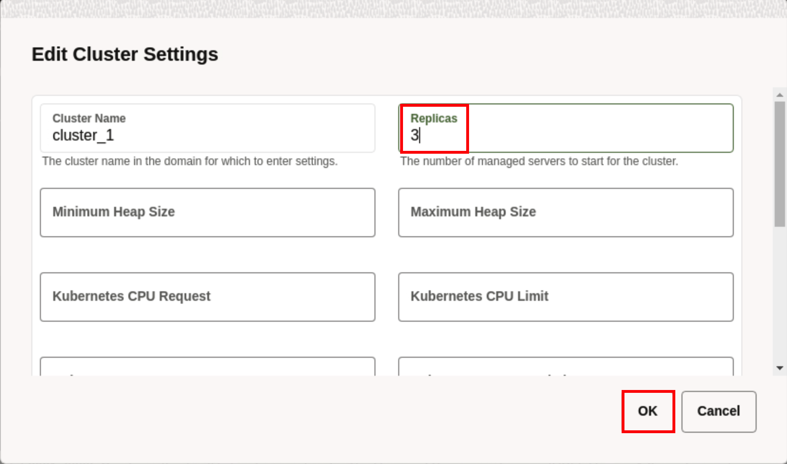
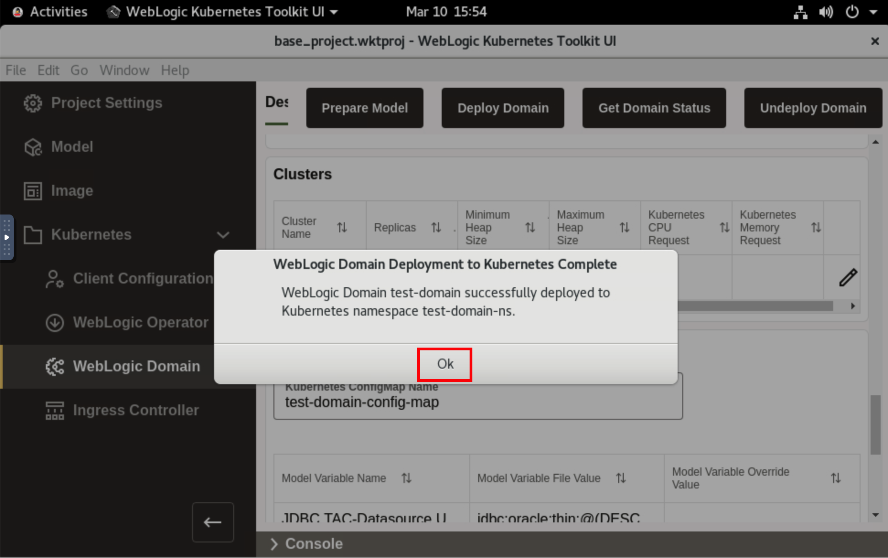

# Scale the WebLogic Cluster 

## Introduction

In this lab, we scale a WebLogic Cluster. Here, we modify the value to *3* and re-deploy the domain.

### Objectives

In this lab, you will:

* Scale a WebLogic Cluster.

### Prerequisites

* Successfully created the virtual machine, which consist of all required softwares.

## Task 1: Scaling a WebLogic Cluster using WebLogic Kubernetes Toolkit UI

In this task, you just need to modify the *Replica* value from 2 to 3 and re-deploy the domain again. 

1. Go back to WebLogic Kubernetes Toolkit UI,  Click *WebLogic Domain*. Go to *Clusters* section and click on *Edit* icon.  
    

2. Change the Replicas from *2* to *3*, and click *OK*. 
    

3. To Re-deploy the domain, click *Deploy Domain*.
    

4. Once you see *WebLogic Domain Deployment to Kubernetes Complete* window, click *Ok*.
    

5. Go back to *Terminal* window, Click *Activities* and select the *Terminal* window. Copy the following command and paste in terminal.
    ```bash
    <copy>kubectl get pods -n test-domain-ns -w</copy>
    ```
    
    > You can see, re-deployment of domain, starts the introspector job, which start the process of creating pod for test-domain-managed-server3 and in sometime, this pod gets into *Running* status.


## Acknowledgements

* **Author** -  Ankit Pandey
* **Contributors** - Maciej Gruszka, Sid Joshi
* **Last Updated By/Date** - Kamryn Vinson, March 2022